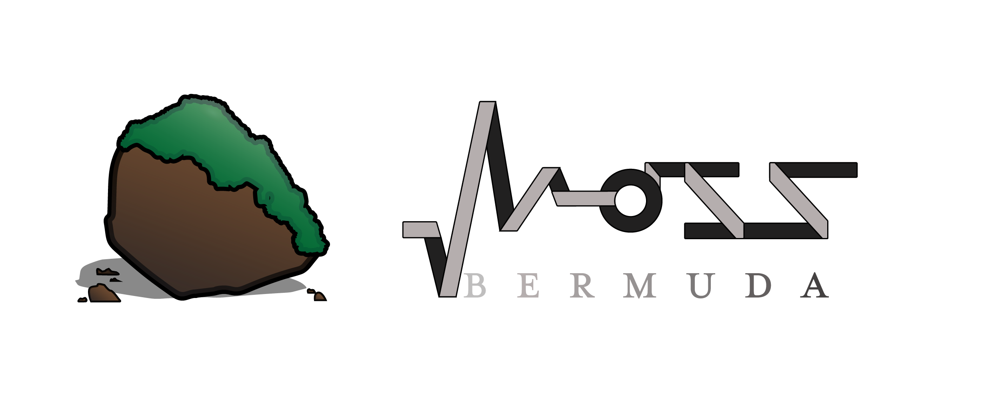

# mossbda-website -An Amazing Project
version: 0.0.1

## Components

**Mobile Navigation Layout**

	<!-- HOMEPAGE MOBILE NAVIGATION BAR -->
	<nav class="navbar navbar-toggleable-md navbar-dark bg-faded fixed-top d-md-none">
		
		<button class="navbar-toggler navbar-toggler-right" type="button" data-toggle="collapse" data-target="#navbarSupportedContent" aria-controls="navbarSupportedContent" aria-expanded="false" aria-label="Toggle navigation">
			
		</button>
		

			<ul class="navbar-nav mr-auto align-items-center">
				<li class="nav-item active">
					<a class="nav-link text-primary active" href="index.html">Home (current)</a>
				</li>
				<li class="nav-item">
					<a class="nav-link text-light" href="games/games.html">Games</a>
				</li>
				<li class="nav-item">
					<a class="nav-link text-light" href="websites/websites.html">Websites</a>
				</li>
				<li class="nav-item">
					<a class="nav-link text-light" href="gallery/gallery.html">Gallery</a>
				</li>
				<li class="nav-item">
					<a class="nav-link text-light" href="blog/blog.html">Blog</a>
				</li>
				<li class="nav-item">
					<a class="nav-link text-light" href="about/about.html">About</a>
				</li>
			</ul>
		

	</nav>

**Desktop Navigation Layout**

	<!-- HOMEPAGE DESKTOP NAVIGATION BAR -->
	

		

			

							
			

			

				<ul class="nav list-inline text-center align-items-center col-12" style="height: 100%;">
					<li class="nav-item">
						<a class="nav-link active" href="index.html">Home</a>
					</li>
					<li class="nav-item">
						<a class="nav-link text-light" href="games/games.html">Games</a>
					</li>
					<li class="nav-item">
						<a class="nav-link text-light" href="websites/websites.html">Websites</a>
					</li>
					<li class="nav-item">
						<a class="nav-link text-light" href="gallery/gallery.html">Gallery</a>
					</li>
					<li class="nav-item">
						<a class="nav-link text-light" href="blog/blog.html">Blog</a>
					</li>
					<li class="nav-item">
						<a class="nav-link text-light" href="about/about.html">About</a>
					</li>
				</ul>
			

		

	

Created by Peter J. Sousa
@2018
